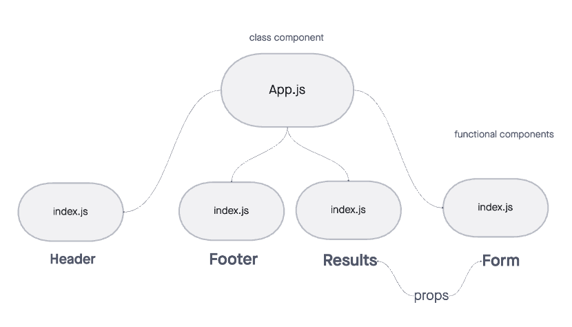

# RESTy

## Problem Domain

Part 2 of a 4-Phase build of the RESTy application. The initial build set up the file structure in order to progressively build the application in a scalable manner. This application can receive user input in preparation of connecting to live APIs, using the useState() hook in our functional components.

## Features 

* Converted all child components of App.js from classes to functions. 

* Use .scss files to style each component

* Core application functionality remain unchanged.

* Refactored components using this.setState to implement the useState react API hook.

* Refactored the Form Component to implement user input from form elements, instead of hard coded string values.

## Deployment Link

[netlify](https://creager-resty.netlify.app/)

## UML

